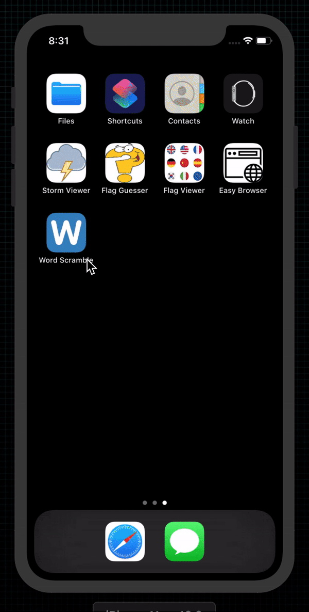

# Word Scramble

  

 
An application asking users to make anagrams out of a given word.

## Examples within this code
- Reloading table views
- Inserting rows into tables
- Text input in alerts
- Strings and UTF-16
- Closures
- NSRange

## Demonstration
Small demonstration as to what the application does when on device.
 

